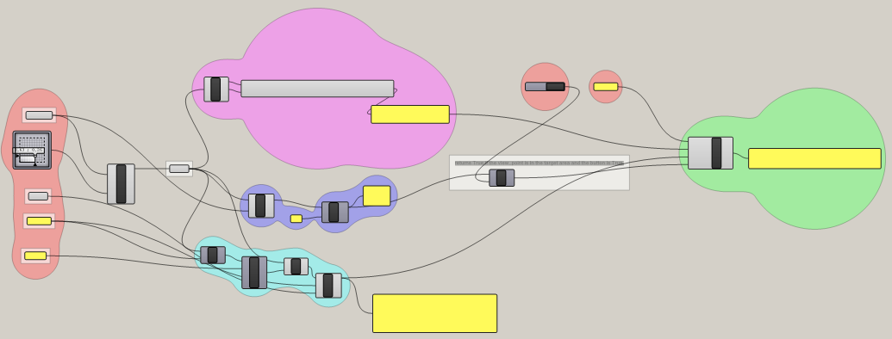

# pointnet_cla
[trimesh](https://trimsh.org/index.html)で作成できるbox、cupsuleなどのプリミティブ形状を[pointnet](https://arxiv.org/abs/1612.00593)で分類するサンプルです。

ゼミでのネタとして作成したものです。
屋上屋を重ねるかたちにはなりますが、建築学生含む情報分野が専門でない人向けに：
* データセットが簡単に用意できる
* 保守性はさておき読みやすい
* とりあえず動かしやすい

ように作成したものもあって良かろうと公開してみます。
二番目は賛否異議あるかもですが、pythonを一通り学んで深層学習やってみようくらいですと、**合理的だけど知ってないと読めない実装で躓きやすい**ので**Pythonの初心者語で書いているつもり**です。

## install
必要なパッケージ（ライブラリ）はrequirements.txtにまとめてあります。Terminalより次のコマンドを実行するとインストールできます。


```
pip install -r requirements.txt
```

必要に応じてCUDAやCuDNNもインストール・設定ください（GPUでなくCPUで実行するならCUDAやCuDNNは不要です）。

## contents
### trimesh_dataset_gen.py
[trimesh](https://trimsh.org/index.html)はPythonで利用できる三角形メッシュを操作するためのライブラリです。
このスクリプトでは、trimeshで生成できるプリミティブな形状のうち、box・capsule・cylinder・scaled_sphereについて、その点群を作成し学習用のデータセットを作成します。なお、scaled_sphereについてはsphereをX軸・Y軸にランダムに拡大して作成してます。

mainのあたり（↓）にてdataset下のフォルダ名や、train・valのデータ数、点群の点数などを指定しています。辞書型をとるprimitivesがちょっとややこしいですが、keyに「"box"」のように意味、valueに「create_box」のように対応する点群を生成するための関数（のオブジェクト）が入っています。

https://github.com/ail-and-colleagues/pointnet_cla/blob/c360bac2710839a416f448139fd900b9f7b23316/trimesh_dataset_gen.py#L114-L120

実行時の引数は設定してないので、Visual Studio Codeで開いて「デバックなしで開始」するか、Terminalから、

```
python trimesh_dataset_gen.py
```
すれば実行できます。実行を終えると、datasetフォルダの中に以下のように学習用データが生成されるはずです。「trimesh_primitives」のなかがここで用いる学習データセットです。

\# 同じような構成で別の点群な学習用データを作成すればそのデータで学習できます。

```
dataset/
|--trimesh_primitives
|  |--train
|  |  |--0
|  |  |  |--box_0000.ply
|  |  |  |--box_0001.ply
|  |  |  `-- ...
|  |  |--1
|  |  |  |--capsule_0000.ply
|  |  |  |--capsule_0001.ply
|  |  |  `-- ..
|  |  `-- ...
|  |--val
|  |  |--0
|  |  |  `-- ...
|  |  `-- ...
|  `-- ...
`-- .gitkeep
```

### train_cla.py
#### network
ネットワークは[kerasのチュートリアル](https://keras.io/examples/vision/pointnet/)を使っています。実装そのものはmodels/pointnet_cla.pyに書いてあります。チュートリアルでは入力された点群から座標変換行列（回転行列）を推定するt-netが関数（t-net）内でlayerを連ねるかたちで定義されていますが、summaryを出力した際に分けて表示されるように別のモデル（tnet(tf.keras.Model)）として定義しています。
#### data_sequence
tf・kerasには[data_sequence](https://www.tensorflow.org/api_docs/python/tf/keras/utils/Sequence)と呼ばれる、学習時に学習用のデータ共有を扱うクラスがあり、ここではこれを使い学習を行っています。実装はloaders/data.loader.pyに書いてあります。

具体的には、生成時に点群データ（.ply）へのパスとそれぞれのラベルを保持しておき、batch分のデータを作る際に呼ばれる__getitem__において、batch分Preprocessを実行してデータを作っています。Preprocessでは点群データ（.ply）へのパスから一つ選んだうえ、それを読み込んだ上で必要数の点をランダムにサンプリングしています。
https://github.com/ail-and-colleagues/pointnet_cla/blob/c360bac2710839a416f448139fd900b9f7b23316/loaders/data_loader.py#L64-L73

#### training
以上のnetwork、data_sequenceを使い学習を行います。なお、以下で学習用データの読み込みと共有を行うようにしているので、ここを変えれば別のデータセットを使えます。

https://github.com/ail-and-colleagues/pointnet_cla/blob/c360bac2710839a416f448139fd900b9f7b23316/train_cla.py#L15-L16

train＿cla.pyにも実行時の引数は設定してないので、Visual Studio Codeで開いて「デバックなしで開始」するか、Terminalから、

```
python train＿cla.py
```

すれば実行できます。

[tf.keras.callbacks.EarlyStopping](https://www.tensorflow.org/api_docs/python/tf/keras/callbacks/EarlyStopping)をcallbackに設定しているので、こちらで試したところEpoch: 10でearly stoppingしました。validationに対するaccracyは95%程度となりました。

```
sparse_categorical_accuracy: 0.9918 - val_loss: 1.2997 - val_sparse_categorical_accuracy: 0.9502 - lr: 5.0000e-04
```

boxは兎も角、cylinderとcapsule、scaled_sphereはもう少し迷うかと思ったのですが、なかなかの正解率となりました。

#### export_3D_isovist_pointcoud.gh
RhinocerosのGrasshopperで3D isovistな三次元点群を出力するサンプルです。**sidenote**で触れた建築作品の（内部空間の視界の広がりの）分類・クラスタリングを対象とした研究で使ったものです。このpointnet_claではtrimesh_Primitivesを学習用としていますが、このような点群を入力することも可能です。これも屋上屋かもしれませんが、Grasshopperで出力まで行うサンプルが近場を探した限り見当たらなかったので公開してみます。



## sidenote
[情報シンポ2021](https://aijisa.org/2021/)では、当時M2の福本くんが、住宅作品5作品（ミース・ファン・デル・ローエ設計の「トゥーゲンハット邸」「ファンズワース邸」「レムケ邸」と、ルイス・カーン設計の「エシェリック邸」「フィッシャー邸」）の3D isovist（点群）をpointnetを使ってクラスタリングすることを行いました。この予備的な検討として当時UG4の前田くんにそもそも「この3D isovist（点群）はどの住宅作品のものか？」を推定するclassificaitonを行ってもらったのですが、90％を超える正解率でした。評価用含む学習用データが人工的に作成されているので学習を行わせやすいシチュエーションだとは思いますが、特徴的でない視点のものは分類できずもう少し正解率が低いと予想していたので意外な精度でした。

このようなpointnet（含む深層学習ネットワーク）による建築の理解については、興味をもってくれる学生も多いので引き続き研究を進めていきたいと思っています。


## links
* [trimesh](https://trimsh.org/index.html)
* [pointnet](https://arxiv.org/abs/1612.00593)
* [kerasのチュートリアル: Point cloud classification with PointNet](https://keras.io/examples/vision/pointnet/)
